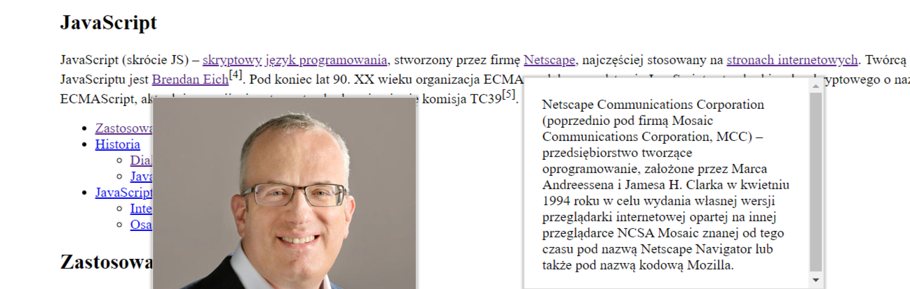
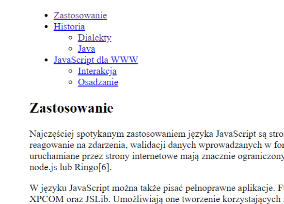

> ⭐ ***README** to coś więcej niż opis. Poprzez nie **pokazujesz swoje mocne strony** – swoją dokładność, sposób myślenia i podejście do rozwiązywania problemów. Niech Twoje README pokaże, że masz **świetne predyspozycje do rozwoju!***
> 
> 🎁 *Zacznij od razu. Skorzystaj z **[szablonu README i wskazówek](https://github.com/devmentor-pl/readme-template)**.* 

&nbsp;


# JavaScript: Elementy DOM

Będziemy musieli utworzyć nowe elementy w drzewie DOM, dodać do wybranych elementów odpowienie klasy, atrybutu czy zawartość i oczywiście wyszukać odpowiedniej miejsca, w których będziemy wykonywać modyfikacje.

## Jaki mamy problem do rozwiązania?

Otrzymaliśmy gotowy kod HTML oraz CSS niestety nie możemy go modyfikować. Wszystko co robimy musi zostać wykonane z poziomu kodu JS. 

Zleceniodawca nie chce nam powiedzieć dlaczego tak jest. Godzimy się na jego warunki ponieważ chcemy zdobyć komercyjne doświadczenie!

### Problem 1: Wygenerowanie linków z *tooltip-em* po najechaniu kursorem myszy

> *Tooltip* to taki dymek pojawiający się w okolicy elementu po kliknięciu lub najechaniu na niego, posiadający dodatkową informację. Przykład możemy zobaczyć [tutaj](https://www.w3schools.com/css/tryit.asp?filename=trycss_tooltip).

> Problem rozwiązujemy w pliku `./assets/js/introduce.js`

Musimy zmodyfikować element o klasie `.tooltip` w taki sposób, aby generował on prawidlową strukturę zgodną z CSS. Obecnie ten element wygląda w taki sposób:

```html
<span 
    class="tooltip"
    data-url="https://pl.wikipedia.org/wiki/J%C4%99zyk_skryptowy" 
    data-tooltip-type="text"
    data-tooltip-content="Język skryptowy (ang. script language) – język programowania obsługujący skrypty[1]. Często służący do kontrolowania określonej aplikacji."
>
    skryptowy
</span>
```

Posiada mnóstwo informacji. Nam zależy na tym, aby wykorzystać te informacje w taki, aby utworzyć taką zawartość:

```html
<a href="https://pl.wikipedia.org/wiki/J%C4%99zyk_skryptowy">
    skryptowy
</a>
<span class="tooltip__box tooltip__box--text">
    Język skryptowy (ang. script language) – język programowania obsługujący skrypty[1]. Często służący do kontrolowania określonej aplikacji.
</span>

```

Czyli zawartośc tego elementu tj. tekst `skryptowy` zamienić (nadpisać) na dwa znaczniki (ang. *tags*). Należy zwrócić uwagę, że pierwszy z nich tj `<a/>` zwiera tekst, który znajdował się w elemencie o klasie `.tooltip`. 

Aby rozwiązać ten problem musimy dla każdego elementu (`.queyrSelectorAll()` i pętla `for` lub `.forEach`), który zawiera te dane (tj. `.tooltip`) utworzyć dwa znaczniki tj. `<a/>` oraz `<span/>` z odpowiednimi klasami i zawartością. Następnie te elementy dodać do `.tooltip` jako kolejne dzieci tego elementu.

Odpowiednią zawartość możemy pobrać z `dataset`, który posiada dane typu adres dla link-u => `.dataset.url`, typ tooltip-u => `.dataset.tooltipType` oraz jego zawartość => `.dataset.tooltipContent`.

Tutaj należy zwrócić uwagę, że mamy różne typy *tooltip-ów*. Może to być *tooltip* tekstowy (`text`) oraz obrazkowy (`image`).

Jeśli *tooltip* jest typem obrazkowym musi zawierać inną strukturę. Podobną do tej:

```html
<a href="https://pl.wikipedia.org/wiki/Strona_internetowa">
    stronach internetowych
</a>
<span class="tooltip__box tooltip__box--image">
    
</span>
```

Jeśli wykonamy prawidłowo podmianę struktury to po najechaniu kursorem na `.tooltip` powinna się pojawić dodatkowa informacje przy najechanym elemencie:




W zależności od typu *tooltip-u* może ona troszkę inaczej wyglądać.

### Problem 2: Wygenerowanie spisu treści na podstawie tablicy obiektów.

> Problem rozwiązujemy w pliku `./assets/js/list.js`.

Otrzymaliśmy od Klienta spis treści w formie tablicy obiektów.

```javascript
const list = [
    {
        id: 1,
        parentId: null,
        text: 'Zastosowanie',
        link: '#Zastosowanie',
    },
    {
        id: 44,
        parentId: null,
        text: 'Historia',
        link: '#Historia',
    },
    {
        id: 7,
        parentId: 44,
        text: 'Dialekty',
        link: '#Dialekty',
    },
    {
        id: 31,
        parentId: 44,
        text: 'Java',
        link: '#Java',
    },
    {
        id: 24,
        parentId: null,
        text: 'JavaScript dla WWW',
        link: '#JavaScript_dla_WWW',

    },
    {
        id: 10,
        parentId: 24,
        text: 'Interakcja',
        link: '#Interakcja'
    },
    {
        id: 25,
        parentId: 24,
        text: 'Osadzanie',
        link: '#Osadzanie',
    }
];
```

Klient zaznaczył, że ta tablica może ulegać modyfikacji i nasze rozwiązanie musi być na tyle elastyczne, aby zmiana zawartości tej tablicy nie powodowała problemów z generowaniem spisu treści.

Wspomniana tablica zawiera obiekty z odpowiednimi danymi:

```javascript
{
    id: 1,
    parentId: null,
    text: 'Zastosowanie',
    link: '#Zastosowanie',
}
```

gdzie:
* **id** - unikalny identyfikator każdego elementu
* **parentId** - id rodzica lub `null`, ten element oznacza czy nasz obiekt jest dzieckiem (posiada ustawiony parentId) lub jest rodzicem
* **text** - zawartość text dla elementu `<a/>`
* **link** - zawatość dla atrybutu `href` w `</a>`

Na podstawie tych danych musimy wygenerowac taki kod html:

```html
<ul>
    <li data-id="1">
        <a href="#Zastosowanie">Zastosowanie</a>
        </li>
    <li data-id="44">
        <a href="#Historia">Historia</a>
        <ul>
            <li><a href="#Dialekty">Dialekty</a></li>
            <li><a href="#Java">Java</a></li>
        </ul>
    </li>
    <li data-id="24">
        <a href="#JavaScript_dla_WWW">JavaScript dla WWW</a>
        <ul>
            <li><a href="#Interakcja">Interakcja</a></li>
            <li><a href="#Osadzanie">Osadzanie</a></li>
        </ul>
    </li>
    <li data-id="6">
        <a href="Linki zewnętrzne">Przypisy</a>
    </li>
</ul>
```

i wstawić go do elementu `.article__list`.

Głównym problemem jest tutaj różny poziom zagnieżdzenia tych elementów. Moglibyśmy rozróżnić dwa poziomu.

Pierwszy to ten, który dotyczy elementów o właściwości `.parentId` równej `null`.

Drugi poziom te elementy, które posiadają rodziców.

#### Propozycja rozwiązania

> Ten problem jest na tyle złożony, że możnaby go było rozwiązać na wiele sposóbów. Ja zaproponuję jeden z nich, ale to nie oznacza, że nie można zrobić tego inaczej (i lepiej!).

Początkowo wygenerowałbym tylko elementy, które są na 1 poziomie zagnieżdzenia. Tutaj mogłbym wykorzystać `.forEach` lub pętle `for` oraz `if-a` wew. iteracji. Sprawdzałbym tylko czy `parentId` jest równe `null`.

Jeśli tak to tworzę odpowiednią zawartość, a do `dataset.id` dopisuję jego id. Po to, aby potem wiedzieć, jaki ten element ma identyfikator. 

Wygenerowany kod powinien wyglądać mniej więcej tak:

```html
<li data-id="44"><a href="#Historia">Historia</a></li>
```

Następnie wyszukałbym wszystkie `li` znajdujące się w odpowiedniej sekcji i znów bym wykorzystał pętlę, aby odnieść sie do każdego elementu z osobna.

Wew. tej pętli mogę pobrać `id` tego elementu np. po przez `const id = Number(item.dataset.id)`.

Następnie wyszukuję wszystkie elementy z tablicy `list`, które posiadają `parentId` równy pobranemu `id`.

Mógłbym to zrobic za pomocą [`.filter()`](https://developer.mozilla.org/pl/docs/Web/JavaScript/Referencje/Obiekty/Array/filter) na tablicy.

```javascript
const children = list.filter(function(element) {
    return element.parentId === id
});
```

Dzięki temu rozwiązaniu wiem, jakie elementy musze utworzyć dla tego zagnieżdzenia (pamiętaj, że może ich nie być w ogóle). Znów piszę kod, który tworzy mi `ul` oraz pętle dla `li`.

Efekt działania naszego kodu powinien być taki jak zakomentowany kod HTML w odpowiedniej sekcji.

Efekt wizualny powinien być miej więcej taki:



Po kliknięciu w element listy powinieneś zostać przekierowany do odpowiedniego nagłówka w treści strony. 

Płynne przejscie jest zrealizowane przez CSS! Zobacz reguły CSS przypisane do znacznika `html`.


&nbsp;

> ⭐ ***README** to coś więcej niż opis. Poprzez nie **pokazujesz swoje mocne strony** – swoją dokładność, sposób myślenia i podejście do rozwiązywania problemów. Niech Twoje README pokaże, że masz **świetne predyspozycje do rozwoju!***
> 
> 🎁 *Zacznij od razu. Skorzystaj z **[szablonu README i wskazówek](https://github.com/devmentor-pl/readme-template)**.* 
